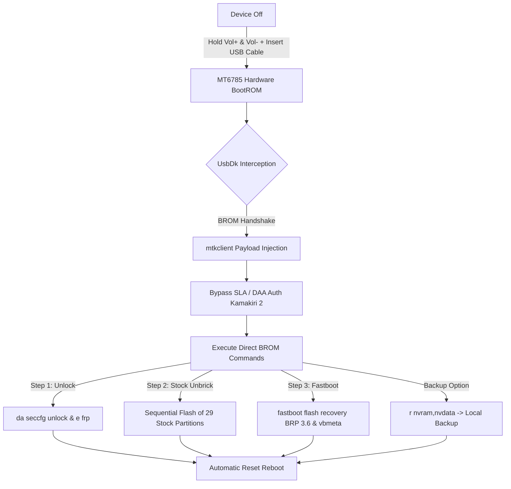

**🇬🇧 English** | [🇫🇷 Lire en Français](README.fr.md)

# Begonia Fleet Tool 🚀

<div align="center">


**Industrial Deployment, Full Unbrick & Instant Unlock Suite for Xiaomi Redmi Note 8 Pro (*Begonia / MT6785*)**

[](https://www.gnu.org/licenses/gpl-3.0)
[](https://www.python.org/)
[](https://www.mi.com)
[-red?style=flat-square&logo=mediatek&logoColor=white)](https://www.mediatek.com)
[](https://github.com/bkerler/mtkclient)
[](#)

[Features](#-key-features) •
[Architecture](#-technical-architecture--mt6785-specifications) •
[Prerequisites](#-prerequisites--installation) •
[Step-by-Step Guide](#-chronological-step-by-step-usage-guide) •
[Unbrick](#-full-stock-rom-unbrick-without-sp-flash-tool) •
[Troubleshooting](#-troubleshooting-guide) •
[License](#-license--credits)

---
</div>

> [!IMPORTANT]
> **Zero SP Flash Tool • Zero Antivirus False Positives • Zero Mi Account / 168h Wait**
> This project permanently replaces shady executables, closed-source cracks, and historically unstable drivers with a 100% open, auditable pipeline based on the official **UsbDk (Red Hat)** driver and the **`mtkclient`** suite.

---

## 📋 Table of Contents

- [1. Project Overview](#-project-overview)
- [2. Comparison Matrix: Legacy vs New Pipeline](#-comparison-matrix-legacy-vs-new-pipeline)
- [3. Key Features](#-key-features)
- [4. Technical Architecture & MT6785 Specifications](#-technical-architecture--mt6785-specifications)
- [5. Repository Structure](#-repository-structure)
- [6. Prerequisites & Installation](#-prerequisites--installation)
- [7. Chronological Step-by-Step Usage Guide](#-chronological-step-by-step-usage-guide)
  - [Step 0: UsbDk Driver](#step-0--usbdk-driver-installation-required-once)
  - [Step 1: Bootloader Unlock & FRP](#step-1--bootloader-unlock--frp-bypass-1-click--5s)
  - [Step 2: Stock MIUI 12.5 EEA Standardization](#step-2--stock-miui-125-eea-standardization-29-partition-unbrick)
  - [Step 3: BRP 3.6 Recovery & VBMeta Flash](#step-3--brp-36-recovery--vbmeta-flash-fastboot-mode)
  - [Step 4: ADB ROM Copy & TWRP Finalization](#step-4--adb-rom-copy--twrp-finalization)
- [8. Full Stock ROM Unbrick (Without SP Flash Tool)](#-full-stock-rom-unbrick-without-sp-flash-tool)
- [9. Troubleshooting Guide](#-troubleshooting-guide)
- [10. License & Credits](#-license--credits)

---

## 🌟 Project Overview

The **Xiaomi Redmi Note 8 Pro** (codename: `begonia` / `begoniain`), powered by the **MediaTek Helio G90T (MT6785)** processor, is notorious for its fragility during flashing. Historically, unlocking and unbricking required:
1. Opaque proprietary tools (**SP Flash Tool**).
2. Modified "Auth Bypass" files frequently flagged as critical malware by Windows Defender.
3. Conflicting `libusb-win32` drivers that destabilized USB ports on the host machine.
4. Authorized Xiaomi accounts ("Mi Authorized Accounts") to bypass SLA/DA protection.

**Begonia Fleet Tool** standardizes and secures the entire smartphone lifecycle through direct injection in **BootROM (BROM)** mode via the **UsbDk** virtualization driver developed by Red Hat / Daynix.

---

## ⚖️ Comparison Matrix: Legacy vs New Pipeline

| Criterion | Legacy Method (SP Flash Tool / MiFlash) | **Begonia Fleet Tool (This project)** |
| :--- | :--- | :--- |
| **Antivirus Security** | ❌ Frequent false positives (`Trojan:Win32/Wacatac`, etc.) | ✅ **0 False Positives** (Python source code & official UsbDk MSI) |
| **Bootloader Unlock** | ⏳ Must wait 168 hours (7 days) via Mi Unlock | ⚡ **Instant (5 seconds)** in BootROM mode |
| **FRP Removal** | ⚠️ Laborious manual workarounds (browser, second space) | ⚡ **1 second** via direct `e frp` command |
| **Unbrick (Hard-brick)** | ❌ Requires paid Mi Authorized account or Dongle | ✅ **Fully autonomous and free** (29 factory partitions) |
| **Driver Management** | ❌ USB filter conflicts (`libusb0.sys` breaks mouse/keyboard) | ✅ **Clean UsbDk in User-Space**, no WinUSB overwrite |
| **Automation** | ❌ Manual, unstable GUI | ✅ **PowerShell & Python scripts automatable in fleet** |

---

## ⚡ Key Features

- 🔓 **1-Click Bootloader Unlock & FRP Bypass**: Rewrites the secure configuration block (`seccfg`) and erases lock partitions in a single hardware session.
- 🛠️ **Standardization & Total Unbrick (29 Partitions)**: Sequential low-level re-injection of the complete official manufacturer ROM (*MIUI 12.5.15.0 RGGEUXM Android 11*) to unify 100% of the fleet.
- 🧩 **Optimized R-OSS Custom ROM Pipeline**:
  - Direct flash of **BRP 3.6** (Bat-Recovery-Project / custom TWRP) and **vbmeta.img** disabling AVB 2.0 (*Android Verified Boot*).
  - Automated deployment of **R-OSS** firmware (*Redmi Open Source Software*) and **Android 13** (*PixelExperience Plus*).
- 🛡️ **IMEI & Calibration Protection**: One-click dump and restore of critical `nvram`, `nvdata`, `protect1`, and `protect2` partitions.
- 💻 **Interactive PowerShell Menu & BAT Scripts**: Intuitive interface for workshop technicians or developers, with real-time environment diagnostics.

---

## 🔬 Technical Architecture & MT6785 Specifications

### 1. Boot Cycle and BROM Interception Sequence



### 2. Key Partition Map

```mermaid
flowchart LR
    subgraph Bootloader_Security [Level 0: Bootloader & Security]
        preloader[preloader_begonia.bin]
        lk[lk / lk2 - Little Kernel]
        tee[tee1 / tee2 - TrustZone]
        seccfg[seccfg - BL Lock]
    end

    subgraph Calibrations_Radio [Level 1: Unique Hardware Data]
        nvram[nvram - IMEI & MAC]
        nvdata[nvdata - RF Calibration]
        protect[protect1 / protect2]
    end

    subgraph Android_Kernel [Level 2: System & Runtime]
        boot[boot.img - Linux Kernel]
        dtbo[dtbo.img - Device Tree]
        recovery[recovery.img - BRP / TWRP]
        vbmeta[vbmeta.img - AVB 2.0 Signatures]
        super[system / vendor / cust / userdata]
    end

    Bootloader_Security --> Calibrations_Radio --> Android_Kernel
```



---

## 📂 Repository Structure

```
Begonia-Fleet-Tool/
├── 📄 0_INSTALLER_PILOTE_USBDK.bat          # 1-click UsbDk installer (Admin)
├── 📄 1_DEVERROUILLER_BOOTLOADER_ET_FRP.bat # Step 1: BL + FRP unlock in BROM mode
├── 📄 2_RESTAURER_STOCK_EEA_UNBRICK.bat     # Step 2: Stock standardization (29 partitions)
├── 📄 3_FLASHER_RECOVERY_ET_VBMETA.bat      # Step 3: TWRP flash in Fastboot
├── 📄 4_ENVOYER_ROM_SUR_TELEPHONE.bat       # Step 4: ADB copy (with Disable/Enable MTP tip)
├── 📄 MENU_GENERAL.bat                      # Full interactive CLI menu
├── 📄 begonia_tool.ps1                      # PowerShell orchestration script
├── 📁 bin/                                  # Standalone Fastboot & ADB utilities
│   ├── adb.exe
│   ├── fastboot.exe
│   └── AdbWinApi.dll
├── 📁 drivers/                              # Certified drivers (UsbDk, android_fastboot.inf)
├── 📁 recovery/                             # [GitHub Releases] BRP 3.6, recovery.img, vbmeta.img
├── 📁 roms/                                 # [GitHub Releases] FW R-OSS + PixelExperience ROM
├── 📁 stock_firmware/                       # [mifirm.net] 29 official MIUI 12.5.15 EEA partitions
├── 📁 src/                                  # Python core (flash_stock_complete.py, mtkclient included)
├── 📄 requirements.txt                      # Python dependencies
├── 📄 .gitignore                            # Archive and sensitive data exclusions
├── 📄 LICENSE                               # GPL-3.0 License
├── 📄 SECURITY.md                           # Vulnerability reporting channel
├── 📄 CONTRIBUTING.md                       # Contribution guide
├── 📄 CHANGELOG.md                          # Version history
├── 📄 README.fr.md                          # French documentation
└── 📄 README.md                             # This documentation (English)
```

> [!NOTE]
> The `recovery/` and `roms/` folders are in the **[GitHub Releases](https://github.com/Arhkos/Begonia-Fleet-Tool/releases)**. The stock firmware `stock_firmware/images/` must be downloaded separately from **[mifirm.net](https://mifirm.net/download/8188)** (too large for GitHub Releases).

---

## 🛠️ Prerequisites & Installation

### System Requirements

| Prerequisite | Version / Detail |
| :--- | :--- |
| **Operating System** | Windows 10 / 11 (64-bit) |
| **Python** | 3.10 or higher |
| **USB Cable** | USB-A → USB-C data-capable cable (not charge-only) |
| **UsbDk Driver** | Included in `drivers/` — install via `0_INSTALLER_PILOTE_USBDK.bat` |

### Installation in 6 Steps

**1. Clone the repository:**
```bash
git clone https://github.com/Arhkos/Begonia-Fleet-Tool.git
cd Begonia-Fleet-Tool
```

> 💡 **Advanced option:** To use the official upstream `mtkclient` instead of the included copy:
> ```bash
> git submodule add https://github.com/bkerler/mtkclient.git src/mtkclient
> ```

**2. Install Python dependencies:**
```bash
pip install -r requirements.txt
```

**3. Download binary files** from the **[GitHub Releases](https://github.com/Arhkos/Begonia-Fleet-Tool/releases)** section:
- `recovery/BRPv3.6.img`, `recovery/recovery.img`, `recovery/vbmeta.img`
- `roms/FW R-OSS + BRP 3.1 - Begonia.zip`

**4. Download the Stock EEA Firmware (29 partitions)** from MiFirm — too large for GitHub Releases:
🔗 **[Download MIUI 12.5.15.0 RGGEUXM — Redmi Note 8 Pro EEA (begonia)](https://mifirm.net/download/8188)**
*(Extract the contents into the `stock_firmware/images/` folder after download)*

**5. Download PixelExperience Plus 13 ROM** directly from the official website:
🔗 **[Download PixelExperience Plus begonia 13.0 (OFFICIAL)](https://get.pixelexperience.org/changelog/begonia/PixelExperience_Plus_begonia-13.0-20231217-1732-OFFICIAL.zip)**
*(Place the ZIP file in the `roms/` folder after download)*

**6. Install the UsbDk driver:** run `0_INSTALLER_PILOTE_USBDK.bat` as Administrator.

---

## 🛠️ Chronological Step-by-Step Usage Guide

### Step 0 — UsbDk Driver Installation (Required Once)

1. Double-click **`0_INSTALLER_PILOTE_USBDK.bat`**.
2. Accept the Administrator elevation prompt (**UAC**).
3. The low-level USB driver is installed and ready to capture the BootROM.

---

### Step 1 — Bootloader Unlock & FRP Bypass (1 Click / 5s)

1. **Power off completely** the phone (unplugged from PC, hold `POWER` for 10 to 15 seconds until the screen goes completely black).
2. Launch **`1_DEVERROUILLER_BOOTLOADER_ET_FRP.bat`**.
3. On the powered-off phone: hold **[VOLUME UP] + [VOLUME DOWN]** simultaneously.
4. **Plug the USB-C cable** into the PC while holding both buttons.
5. As soon as text starts scrolling on screen, **release the buttons**.

---

### Step 2 — Stock MIUI 12.5 EEA Standardization (29 Partition Unbrick)

> [!TIP]
> This step unifies all security co-processors (TEE, GZ, SSPM, Little Kernel) on the official **Android 11 R-OSS** base, guaranteeing proper Recovery and ROM startup.

1. Launch **`2_RESTAURER_STOCK_EEA_UNBRICK.bat`**.
2. Phone off: hold **[VOLUME UP] + [VOLUME DOWN]** and plug the USB-C cable.
3. Once flashing starts, release the buttons.
4. The script writes the 29 official factory partitions (duration: ~20 to 25 minutes). The phone reboots on a clean base.

---

### Step 3 — BRP 3.6 Recovery & VBMeta Flash (Fastboot Mode)

1. Boot phone into **FASTBOOT** mode: hold **[VOLUME DOWN] + [POWER]** until the Fastboot screen (orange text or Xiaomi bunny).
2. Plug the USB cable into the PC.
3. Launch **`3_FLASHER_RECOVERY_ET_VBMETA.bat`**.
4. The script flashes `BRPv3.6.img`, `recovery.img` and disables integrity verification (`vbmeta.img --disable-verity --disable-verification`).
5. Phone reboots automatically into Recovery. If screen stays black, hold **[VOLUME UP]**.

---

### Step 4 — ADB ROM Copy & TWRP Finalization

#### 1. USB connection preparation in TWRP:
1. On the phone in **TWRP**: Go to the **`Mount`** menu.
2. Tap **`Disable MTP`** then re-enable with **`Enable MTP`** *(Essential trick to initialize ADB detection on Windows)*.
3. Leave the phone connected to the PC.

#### 2. File copy:
1. Launch **`4_ENVOYER_ROM_SUR_TELEPHONE.bat`**.
2. Files `FW R-OSS + BRP 3.1 - Begonia.zip` and `PixelExperience_Plus_begonia-13.0...zip` are transferred to `/sdcard/`.

#### 3. Final menu in TWRP (on the phone screen):
1. **`Install`** ➔ Select and flash **`FW R-OSS + BRP 3.1 - Begonia.zip`**.
2. **`Install`** ➔ Select and flash **`PixelExperience_Plus_begonia-13.0-20231217-1732-OFFICIAL.zip`**.
3. **`Mount`** ➔ Check **`System`** and **`Vendor`**.
4. **`Advanced`** ➔ Click **`Root (Magisk)`**.
5. **`Advanced`** ➔ Click **`Disable Force Encrypt`**.
6. **`Advanced`** ➔ Click **`Disable TWRP Replace`**.
7. **`Wipe`** ➔ Click **`Format Data`** ➔ Type **`yes`**.
8. **`Reboot`** ➔ **`System`**.

🎉 **The phone boots into PixelExperience Plus 13 (Android 13), rooted with Magisk and unencrypted!**

---

## 🔄 Full Stock ROM Unbrick (Without SP Flash Tool)

> [!IMPORTANT]
> This operation corresponds to **Step 2** of the main pipeline. It is documented separately because it can be run **independently** to recover a fully hard-bricked device.

The full unbrick re-injects the entire official stock ROM **MIUI 12.5.15.0 EEA** directly in **BootROM mode**, without requiring SP Flash Tool, Mi Authorized account, or hardware dongle.

### Procedure

1. Launch **`2_RESTAURER_STOCK_EEA_UNBRICK.bat`** (or option 3 of `MENU_GENERAL.bat`).
2. Power off the phone completely (hold `POWER` for 10 to 15 seconds).
3. Hold `[VOLUME UP] + [VOLUME DOWN]` and plug the USB-C cable into the PC.
4. Once progress bars appear on screen, release the buttons.
5. Flashing the **29 factory partitions** takes approximately **20 to 25 minutes**.
6. The phone reboots automatically on a clean MIUI base.

### Reset Partitions

| Level | Partitions |
| :--- | :--- |
| **Bootloader & Security** | `preloader`, `lk`, `lk2`, `tee1`, `tee2`, `gz1`, `gz2`, `sspm_1`, `sspm_2`, `scp1`, `scp2` |
| **Kernel & Boot** | `boot`, `recovery`, `dtbo`, `vbmeta`, `logo` |
| **Low-Level Hardware** | `md1img`, `audio_dsp`, `cam_vpu1/2/3`, `spmfw`, `exaid`, `oem_misc1` |
| **System & Data** | `system`, `vendor`, `cust`, `cache`, `userdata` |

> [!WARNING]
> The `userdata` partition is reset during this operation. **All user data on the phone is permanently erased.**

---

## 🔧 Troubleshooting Guide

### ❌ Phone not detected in BootROM mode
- Check that the **UsbDk** driver is properly installed (run `0_INSTALLER_PILOTE_USBDK.bat`).
- Try a different **USB port** (USB 2.0 ports are often more reliable for BROM).
- Try a different **USB-C cable** (charge-only cables do not carry data).
- Make sure the phone is **completely powered off** — not in deep sleep.
- Open Windows **Device Manager**: check for exclamation marks on `MediaTek USB Port`.

### ❌ ADB not detecting the phone in TWRP
- On the phone in TWRP: **Mount** → **Disable MTP** → **Enable MTP**.
- This toggle cycle is essential to initialize the ADB driver on Windows.
- Verify that `adb.exe` and `AdbWinApi.dll` are present in the `bin/` folder.

### ❌ Fastboot error `FAILED (remote: 'Partition not found')`
- The bootloader may not be unlocked yet. Run **Step 1** first.
- Verify the phone is in **Fastboot mode** (screen with orange text or Xiaomi mascot), not in Recovery.

### ❌ Flash interrupted mid-way (BootROM mode)

> [!CAUTION]
> Never unplug the USB cable during a BootROM operation — this will cause a hard brick.

If interrupted, restart from the beginning of the relevant step. The phone remains accessible in BROM as long as it is **powered off and connected** with Volume buttons held.

### ❌ Python not found / `ModuleNotFoundError`
- Verify Python 3.10+ is installed and added to the **Windows PATH** (checkbox during installation).
- Install dependencies: `pip install -r requirements.txt`
- If `mtkclient` is still not found: `pip install -r src/mtkclient/requirements.txt`

---

## 📄 License & Credits

- **mtkclient** by [Bjoern Kerler (bkerler)](https://github.com/bkerler/mtkclient) — GPL-3.0 License.
- **Begonia Recovery Project (BRP)** by Ishita / Team Win Recovery Project.
- **PixelExperience Plus Begonia** by the PixelExperience team.
- **UsbDk** by Red Hat / Daynix — Apache 2.0 License (see `drivers/`).
- **Begonia Fleet Tool project** under **GNU General Public License v3.0**.
