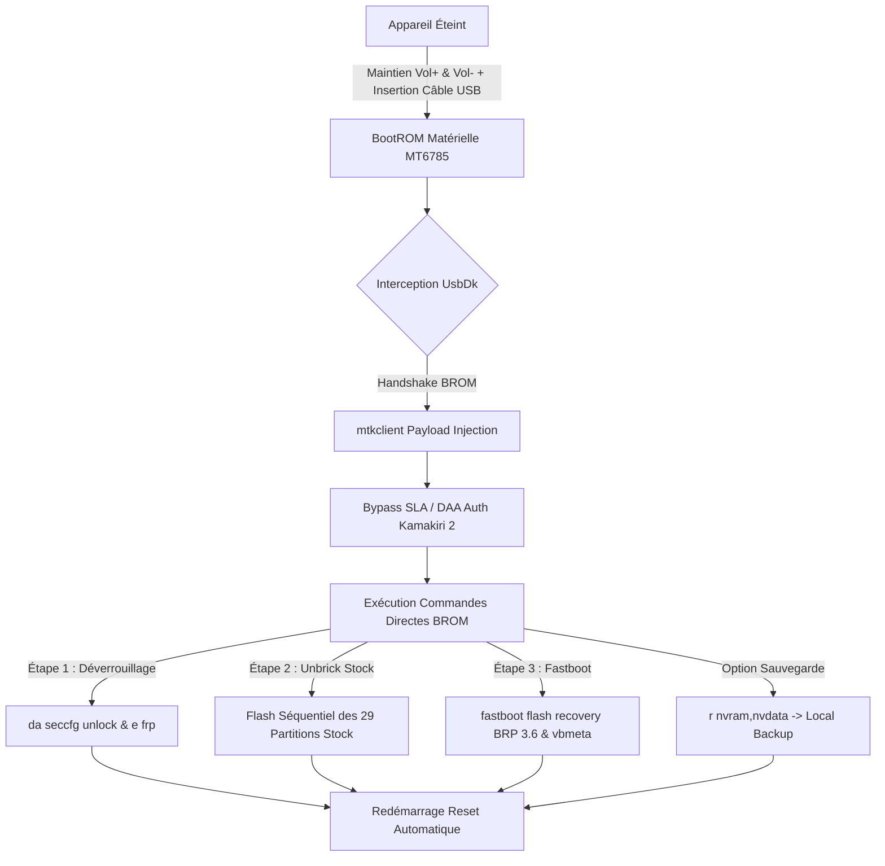

[🇬🇧 Read in English](README.en.md) | **🇫🇷 Lire en Français**

# Begonia Fleet Tool 🚀

<div align="center">


**Outil Industriel de Déploiement, Débriquage Intégral & Déverrouillage Instantané pour Xiaomi Redmi Note 8 Pro (*Begonia / MT6785*)**

[](https://www.gnu.org/licenses/gpl-3.0)
[](https://www.python.org/)
[](https://www.mi.com)
[-red?style=flat-square&logo=mediatek&logoColor=white)](https://www.mediatek.com)
[](https://github.com/bkerler/mtkclient)
[](#)

[Fonctionnalités](#-fonctionnalités-clés) •
[Architecture](#-architecture-technique--spécifications-mt6785) •
[Prérequis](#-prérequis--installation) •
[Guide Pas-à-Pas](#-guide-dutilisation-chronologique-pas-à-pas) •
[Débriquage](#-débriquage-intégral-rom-stock-sans-sp-flash-tool) •
[Dépannage](#-guide-de-dépannage--résolution-des-erreurs) •
[English Summary](#-english-executive-summary--quick-start)

---
</div>

> [!IMPORTANT]
> **Zéro SP Flash Tool • Zéro Faux Positif Antivirus • Zéro Compte Mi / Délai 168h**
> Ce projet remplace définitivement les exécutables douteux, cracks fermés et pilotes instables historiques par un pipeline 100% ouvert, auditable et basé sur le pilote officiel **UsbDk (Red Hat)** et la suite **`mtkclient`**.

---

## 📋 Table des Matières

- [1. Vue d'Ensemble du Projet](#-vue-densemble-du-projet)
- [2. Matrice Comparative : Ancien vs Nouveau Pipeline](#-matrice-comparative--ancien-vs-nouveau-pipeline)
- [3. Fonctionnalités Clés](#-fonctionnalités-clés)
- [4. Architecture Technique & Spécifications MT6785](#-architecture-technique--spécifications-mt6785)
- [5. Structure du Dépôt](#-structure-du-dépôt)
- [6. Prérequis & Installation](#-prérequis--installation)
- [7. Guide d'Utilisation Chronologique Pas-à-Pas](#-guide-dutilisation-chronologique-pas-à-pas)
  - [Étape 0 : Pilote UsbDk](#étape-0--installation-du-pilote-usbdk-requis-une-seule-fois)
  - [Étape 1 : Déverrouillage Bootloader & FRP](#étape-1--déverrouillage-bootloader--bypass-frp-1-clic--5s)
  - [Étape 2 : Standardisation Stock MIUI 12.5 EEA](#étape-2--standardisation-stock-miui-125-eea-débriquage-29-partitions)
  - [Étape 3 : Flash du Recovery BRP 3.6 & VBMeta](#étape-3--flash-du-recovery-brp-36--vbmeta-mode-fastboot)
  - [Étape 4 : Copie ADB des ROMs & Finalisation dans TWRP](#étape-4--copie-adb-des-roms--finalisation-dans-twrp)
- [8. Débriquage Intégral ROM Stock (Sans SP Flash Tool)](#-débriquage-intégral-rom-stock-sans-sp-flash-tool)
- [9. Guide de Dépannage & Résolution des Erreurs](#-guide-de-dépannage--résolution-des-erreurs)
- [10. English Executive Summary & Quick Start](#-english-executive-summary--quick-start)
- [11. Licence & Remerciements](#-licence--remerciements)

---

## 🌟 Vue d'Ensemble du Projet

Le **Xiaomi Redmi Note 8 Pro** (nom de code : `begonia` / `begoniain`), propulsé par le processeur **MediaTek Helio G90T (MT6785)**, est réputé pour sa fragilité lors du flashage. Historiquement, le déverrouillage et le débriquage nécessitaient :
1. Des outils propriétaires opaques (**SP Flash Tool**).
2. Des "Bypass Auth" modifiés souvent flagués comme des malwares critiques par Windows Defender.
3. Des pilotes `libusb-win32` conflictuels rendant instables les ports USB de la machine hôte.
4. Des comptes Xiaomi autorisés ("Mi Authorized Accounts") pour contourner la protection SLA/DA.

**Begonia Fleet Tool** standardise et sécurise l'intégralité du cycle de vie du smartphone grâce à l'injection directe en mode **BootROM (BROM)** via le pilote de virtualisation **UsbDk** développé par Red Hat / Daynix.

---

## ⚖️ Matrice Comparative : Ancien vs Nouveau Pipeline

| Critère | Ancienne Méthode (SP Flash Tool / MiFlash) | **Begonia Fleet Tool (Ce projet)** |
| :--- | :--- | :--- |
| **Sécurité Antivirus** | ❌ Faux positifs fréquents (`Trojan:Win32/Wacatac`, etc.) | ✅ **0 Faux Positif** (Code source Python & MSI UsbDk officiel) |
| **Déverrouillage Bootloader** | ⏳ Obligation d'attendre 168 heures (7 jours) via Mi Unlock | ⚡ **Instantané (5 secondes)** en mode BootROM |
| **Suppression FRP** | ⚠️ Contournements manuels laborieux (navigateur, second espace) | ⚡ **1 seconde** via commande `e frp` directe |
| **Débriquage (Hard-brick)** | ❌ Nécessite un compte Mi Authorized payant ou Dongle | ✅ **Totalement autonome et gratuit** (29 partitions d'usine) |
| **Gestion des Pilotes** | ❌ Conflits de filtres USB (`libusb0.sys` brise la souris/clavier) | ✅ **UsbDk propre en User-Space**, pas d'écrasement WinUSB |
| **Automatisation** | ❌ Interface graphique manuelle et instable | ✅ **Scripts PowerShell & Python automatisables en flotte** |

---

## ⚡ Fonctionnalités Clés

- 🔓 **Déverrouillage Bootloader & Bypass FRP 1-Clic** : Réécriture du bloc de configuration sécurisée (`seccfg`) et effacement des partitions de verrouillage en une seule session matérielle.
- 🛠️ **Standardisation & Unbrick Total (29 Partitions)** : Réinjection séquentielle bas niveau de la totalité de la ROM constructeur officielle (*MIUI 12.5.15.0 RGGEUXM Android 11*) pour unifier 100% de la flotte.
- 🧩 **Pipeline Custom ROM R-OSS Optimisé** :
  - Flash direct de **BRP 3.6** (Bat-Recovery-Project / TWRP personnalisé) et de **vbmeta.img** désactivant l'AVB 2.0 (*Android Verified Boot*).
  - Déploiement automatisé du firmware **R-OSS** (*Redmi Open Source Software*) et d'**Android 13** (*PixelExperience Plus*).
- 🛡️ **Protection IMEI & Calibrations** : Dump et restauration en un clic des partitions critiques `nvram`, `nvdata`, `protect1` et `protect2`.
- 💻 **Menu Interactif PowerShell & Scripts BAT** : Interface intuitive pour techniciens d'atelier ou développeurs, avec diagnostic d'environnement en temps réel.

---

## 🔬 Architecture Technique & Spécifications MT6785

### 1. Cycle de Boot et Séquence d'Interception BROM



### 2. Cartographie des Partitions Clés

```mermaid
flowchart LR
    subgraph Bootloader_Securite [Niveau 0 : Bootloader & Sécurité]
        preloader[preloader_begonia.bin]
        lk[lk / lk2 - Little Kernel]
        tee[tee1 / tee2 - TrustZone]
        seccfg[seccfg - Verrouillage BL]
    end

    subgraph Calibrations_Radio [Niveau 1 : Données Uniques Matériel]
        nvram[nvram - IMEI & MAC]
        nvdata[nvdata - RF Calibration]
        protect[protect1 / protect2]
    end

    subgraph Noyau_Android [Niveau 2 : Système & Exécution]
        boot[boot.img - Linux Kernel]
        dtbo[dtbo.img - Device Tree]
        recovery[recovery.img - BRP / TWRP]
        vbmeta[vbmeta.img - AVB 2.0 Signatures]
        super[system / vendor / cust / userdata]
    end

    Bootloader_Securite --> Calibrations_Radio --> Noyau_Android
```



---

## 📂 Structure du Dépôt

```
begonia-fleet-tool/
├── 📄 0_INSTALLER_PILOTE_USBDK.bat          # Installateur UsbDk 1-clic (Admin)
├── 📄 1_DEVERROUILLER_BOOTLOADER_ET_FRP.bat # Étape 1 : Déverrouillage BL + FRP en BROM
├── 📄 2_RESTAURER_STOCK_EEA_UNBRICK.bat     # Étape 2 : Standardisation Stock 29 partitions
├── 📄 3_FLASHER_RECOVERY_ET_VBMETA.bat      # Étape 3 : Flash TWRP en Fastboot
├── 📄 4_ENVOYER_ROM_SUR_TELEPHONE.bat       # Étape 4 : Copie ADB (avec rappel Disable/Enable MTP)
├── 📄 MENU_GENERAL.bat                      # Menu interactif CLI complet
├── 📄 begonia_tool.ps1                      # Script d'orchestration PowerShell
├── 📁 bin/                                  # Utilitaires Fastboot & ADB autonomes
│   ├── adb.exe
│   ├── fastboot.exe
│   └── AdbWinApi.dll
├── 📁 drivers/                              # Pilotes certifiés (UsbDk, android_fastboot.inf)
├── 📁 recovery/                             # [GitHub Releases] BRP 3.6, recovery.img, vbmeta.img
├── 📁 roms/                                 # [GitHub Releases] FW R-OSS + ROM PixelExperience
├── 📁 stock_firmware/                       # [mifirm.net] 29 partitions MIUI 12.5.15 EEA
├── 📁 src/                                  # Cœur Python (flash_stock_complete.py, mtkclient inclus)
├── 📄 requirements.txt                      # Dépendances Python
├── 📄 .gitignore                            # Exclusion des archives et données sensibles
├── 📄 LICENSE                               # Licence GPL-3.0
├── 📄 SECURITY.md                           # Canal de signalement des vulnérabilités
├── 📄 CONTRIBUTING.md                       # Guide de contribution
├── 📄 CHANGELOG.md                          # Historique des versions
└── 📄 README.md                             # Cette documentation
```

> [!NOTE]
> Les dossiers `recovery/` et `roms/` sont dans les **[GitHub Releases](https://github.com/Arhkos/Begonia-Fleet-Tool/releases)**. Le firmware stock `stock_firmware/images/` est à télécharger séparément sur **[mifirm.net](https://mifirm.net/download/8188)** (trop volumineux pour GitHub Releases).

---

## 🛠️ Prérequis & Installation

### Configuration Requise

| Prérequis | Version / Détail |
| :--- | :--- |
| **Système d'exploitation** | Windows 10 / 11 (64-bit) |
| **Python** | 3.10 ou supérieur |
| **Câble USB** | USB-A → USB-C de qualité données (pas charge uniquement) |
| **Pilote UsbDk** | Inclus dans `drivers/` — installation via `0_INSTALLER_PILOTE_USBDK.bat` |

### Installation en 6 Étapes

**1. Cloner le dépôt :**
```bash
git clone https://github.com/Arhkos/Begonia-Fleet-Tool.git
cd Begonia-Fleet-Tool
```

> 💡 **Option avancée :** Pour utiliser la version upstream officielle de `mtkclient` plutôt que la copie incluse :
> ```bash
> git submodule add https://github.com/bkerler/mtkclient.git src/mtkclient
> ```

**2. Installer les dépendances Python :**
```bash
pip install -r requirements.txt
```

**3. Télécharger les fichiers binaires** depuis les **[GitHub Releases](https://github.com/Arhkos/Begonia-Fleet-Tool/releases)** du dépôt :
- `recovery/BRPv3.6.img`, `recovery/recovery.img`, `recovery/vbmeta.img`
- `roms/FW R-OSS + BRP 3.1 - Begonia.zip`

**4. Télécharger le Firmware Stock EEA (29 partitions)** depuis MiFirm — trop volumineux pour GitHub Releases :
🔗 **[Télécharger MIUI 12.5.15.0 RGGEUXM — Redmi Note 8 Pro EEA (begonia)](https://mifirm.net/download/8188)**
*(Extrayez le contenu dans le dossier `stock_firmware/images/` après téléchargement)*

**5. Télécharger la ROM PixelExperience Plus 13** directement depuis le site officiel :
🔗 **[Télécharger PixelExperience Plus begonia 13.0 (OFFICIAL)](https://get.pixelexperience.org/changelog/begonia/PixelExperience_Plus_begonia-13.0-20231217-1732-OFFICIAL.zip)**
*(Placez le fichier ZIP dans le dossier `roms/` après téléchargement)*

**6. Installer le pilote UsbDk :** lancez `0_INSTALLER_PILOTE_USBDK.bat` en tant qu'Administrateur (voir Étape 0 ci-dessous).

---

## 🛠️ Guide d'Utilisation Chronologique Pas-à-Pas

### Étape 0 : Installation du Pilote UsbDk (Requis une seule fois)

1. Double-cliquez sur **`0_INSTALLER_PILOTE_USBDK.bat`**.
2. Acceptez la fenêtre d'élévation Administrateur (**UAC**).
3. Le pilote USB direct de bas niveau est installé et prêt pour capturer le BootROM.

---

### Étape 1 : Déverrouillage Bootloader & Bypass FRP (1 Clic / 5s)

1. **Éteindre complètement** le téléphone (débranché du PC, maintenez le bouton `POWER` pendant 10 à 15 secondes jusqu'à l'extinction complète de l'écran).
2. Lancez **`1_DEVERROUILLER_BOOTLOADER_ET_FRP.bat`**.
3. Sur le téléphone éteint : Maintenez enfoncé **[VOLUME HAUT] + [VOLUME BAS]** simultanément.
4. **Branchez le câble USB-C** au PC tout en maintenant les deux boutons.
5. Dès que le texte commence à défiler à l'écran, **relâchez les boutons**.

---

### Étape 2 : Standardisation Stock MIUI 12.5 EEA (Débriquage 29 Partitions)

> [!TIP]
> Cette étape uniformise l'ensemble des coprocesseurs de sécurité (TEE, GZ, SSPM, Little Kernel) sur le socle officiel **Android 11 R-OSS**, garantissant le bon démarrage du Recovery et de la ROM.

1. Lancez **`2_RESTAURER_STOCK_EEA_UNBRICK.bat`**.
2. Téléphone éteint : Maintenez **[VOLUME HAUT] + [VOLUME BAS]** et branchez le câble USB-C.
3. Dès que le flash démarre, relâchez les boutons.
4. Le script écrit les 29 partitions officielles d'usine (durée : 2 à 4 minutes). Le téléphone redémarre sur une base saine.

---

### Étape 3 : Flash du Recovery BRP 3.6 & VBMeta (Mode Fastboot)

1. Démarrez le téléphone en mode **FASTBOOT** : Maintenez enfoncé **[VOLUME BAS] + [POWER]** jusqu'à l'écran Fastboot (texte orange ou bunny Xiaomi).
2. Branchez le câble USB au PC.
3. Lancez **`3_FLASHER_RECOVERY_ET_VBMETA.bat`**.
4. Le script flashe `BRPv3.6.img`, `recovery.img` et désactive le contrôle d'intégrité (`vbmeta.img --disable-verity --disable-verification`).
5. Le téléphone redémarre automatiquement en Recovery. Si l'écran reste noir, maintenez **[VOLUME HAUT]**.

---

### Étape 4 : Copie ADB des ROMs & Finalisation dans TWRP

#### 1. Préparation de la liaison USB dans TWRP :
1. Sur le téléphone dans l'écran de **TWRP** : Allez dans le menu **`Mount`**.
2. Cliquez sur **`Disable MTP`** puis réactivez-le avec **`Enable MTP`** *(Astuce indispensable pour initialiser la détection ADB sur Windows)*.
3. Laissez le téléphone branché au PC.

#### 2. Copie des fichiers :
1. Lancez **`4_ENVOYER_ROM_SUR_TELEPHONE.bat`**.
2. Les fichiers `FW R-OSS + BRP 3.1 - Begonia.zip` et `PixelExperience_Plus_begonia-13.0...zip` sont transférés sur `/sdcard/`.

#### 3. Menu final dans TWRP (sur l'écran du téléphone) :
1. **`Install`** ➔ Sélectionner et flasher **`FW R-OSS + BRP 3.1 - Begonia.zip`**.
2. **`Install`** ➔ Sélectionner et flasher **`PixelExperience_Plus_begonia-13.0-20231217-1732-OFFICIAL.zip`**.
3. **`Mount`** ➔ Cocher les cases **`System`** et **`Vendor`**.
4. **`Advanced`** ➔ Cliquer sur **`Root (Magisk)`**.
5. **`Advanced`** ➔ Cliquer sur **`Disable Force Encrypt`**.
6. **`Advanced`** ➔ Cliquer sur **`Disable TWRP Replace`**.
7. **`Wipe`** ➔ Cliquer sur **`Format Data`** ➔ Taper **`yes`** *(Détruit le chiffrement matériel résiduel et formate le stockage à neuf)*.
8. **`Reboot`** ➔ **`System`**.

🎉 **Le téléphone démarre sous PixelExperience Plus 13 (Android 13), rooté avec Magisk, non chiffré et prêt pour votre MDM !**

---

## 🔄 Débriquage Intégral ROM Stock (Sans SP Flash Tool)

> [!IMPORTANT]
> Cette opération correspond à l'**Étape 2** du pipeline principal. Elle est documentée séparément car elle peut être exécutée **de manière indépendante** pour récupérer un téléphone en état de hard-brick total.

Le débriquage intégral réinjecte l'intégralité de la ROM stock officielle **MIUI 12.5.15.0 EEA** directement en mode **BootROM**, sans nécessiter SP Flash Tool, compte Mi Authorized, ni dongle matériel.

### Procédure

1. Lancez **`2_RESTAURER_STOCK_EEA_UNBRICK.bat`** (ou l'option 3 du `MENU_GENERAL.bat`).
2. Éteignez le téléphone complètement (maintenez `POWER` 10 à 15 secondes).
3. Maintenez `[VOLUME HAUT] + [VOLUME BAS]` et branchez le câble USB-C au PC.
4. Dès que les barres de progression apparaissent à l'écran, relâchez les boutons.
5. Le flash des **29 partitions d'usine** prend environ **3 à 5 minutes**.
6. Le téléphone redémarre automatiquement sur une base MIUI saine.

### Partitions Réinitialisées

| Niveau | Partitions |
| :--- | :--- |
| **Bootloader & Sécurité** | `preloader`, `lk`, `lk2`, `tee1`, `tee2`, `gz1`, `gz2`, `sspm_1`, `sspm_2`, `scp1`, `scp2` |
| **Noyau & Démarrage** | `boot`, `recovery`, `dtbo`, `vbmeta`, `logo` |
| **Matériel Bas-Niveau** | `md1img`, `audio_dsp`, `cam_vpu1/2/3`, `spmfw`, `exaid`, `oem_misc1` |
| **Système & Données** | `system`, `vendor`, `cust`, `cache`, `userdata` |

> [!WARNING]
> La partition `userdata` est réinitialisée lors de cette opération. **Toutes les données utilisateur du téléphone sont irrémédiablement effacées.**

---

## 🔧 Guide de Dépannage & Résolution des Erreurs

### ❌ Le téléphone n'est pas détecté en mode BootROM
- Vérifiez que le pilote **UsbDk** est bien installé (lancez `0_INSTALLER_PILOTE_USBDK.bat`).
- Essayez un autre **port USB** (les ports USB 2.0 sont souvent plus fiables pour le BROM).
- Essayez un autre **câble USB-C** (les câbles "charge uniquement" ne transmettent pas de données).
- Assurez-vous que le téléphone est **complètement éteint** — pas en veille profonde.
- Ouvrez le **Gestionnaire de périphériques** Windows : vérifiez l'absence de point d'exclamation sur `MediaTek USB Port`.

### ❌ ADB ne détecte pas le téléphone dans TWRP
- Sur le téléphone dans TWRP : **Mount** → **Disable MTP** → **Enable MTP**.
- Ce cycle de désactivation/réactivation est indispensable pour initialiser le pilote ADB sous Windows.
- Vérifiez que les utilitaires `adb.exe` et `AdbWinApi.dll` sont présents dans le dossier `bin/`.

### ❌ Erreur Fastboot `FAILED (remote: 'Partition not found')`
- Le bootloader n'est peut-être pas encore déverrouillé. Exécutez d'abord l'**Étape 1**.
- Vérifiez que le téléphone est bien en mode **Fastboot** (écran avec texte orange ou mascotte Xiaomi), et non en Recovery.

### ❌ Le flash s'interrompt au milieu (mode BootROM)

> [!CAUTION]
> Ne jamais débrancher le câble USB pendant une opération BootROM sous peine de hard-brick.

En cas d'interruption, relancez depuis le début de l'étape concernée. Le téléphone reste accessible en BROM tant qu'il est **éteint et branché** avec les boutons Volume maintenus.

### ❌ Python non trouvé / `ModuleNotFoundError`
- Vérifiez que Python 3.10+ est installé et ajouté au **PATH Windows** (case à cocher lors de l'installation).
- Installez les dépendances : `pip install -r requirements.txt`
- Si le module `mtkclient` est toujours introuvable : `pip install -r src/mtkclient/requirements.txt`

---

## 🌐 English Executive Summary & Quick Start

### Overview
**Begonia Fleet Tool** is an industrial, production-grade deployment and unbrick suite for the **Xiaomi Redmi Note 8 Pro (MT6785 / Helio G90T)**. It entirely replaces legacy, closed-source tools (**SP Flash Tool**, cracked Auth bypasses, and virus-flagged DLLs) with a clean, 100% open-source pipeline powered by **Red Hat's UsbDk** driver and **`mtkclient`**.

### Core Capabilities
- ⚡ **Instant Bootloader Unlock & FRP Wipe**: Zero Mi Account or 168h delay required.
- 🛡️ **Zero Malware / Zero False-Positive**: Fully open-source Python scripts and official signed drivers.
- 🔄 **Total Unbrick**: Re-flash 29 raw factory partitions directly through low-level BootROM.
- 📱 **Clean Custom ROM Migration**: Turnkey deployment for BRP 3.6 Recovery, AVB 2.0 patch, R-OSS Unified Firmware, and Android 13 (PixelExperience Plus).

### Quick Start (4 Steps)
1. **Driver Setup**: Run `0_INSTALLER_PILOTE_USBDK.bat` as Administrator.
2. **Unlock Bootloader**: Run `1_DEVERROUILLER_BOOTLOADER_ET_FRP.bat`, power off phone, hold `[VOL +]` & `[VOL -]` and plug USB-C.
3. **Standardize Stock Firmware**: Run `2_RESTAURER_STOCK_EEA_UNBRICK.bat` in BootROM mode.
4. **Flash Custom Recovery & ROM**: Run `3_FLASHER_RECOVERY_ET_VBMETA.bat` in Fastboot, then `4_ENVOYER_ROM_SUR_TELEPHONE.bat` via ADB.

For the full English documentation, see **[README.en.md](README.en.md)**.

---

## 📄 Licence & Remerciements

- **mtkclient** par [Bjoern Kerler (bkerler)](https://github.com/bkerler/mtkclient) — Licence GPL-3.0.
- **Begonia Recovery Project (BRP)** par Ishita / Team Win Recovery Project.
- **PixelExperience Plus Begonia** par l'équipe PixelExperience.
- **UsbDk** par Red Hat / Daynix — Licence Apache 2.0 (voir `drivers/`).
- **Projet Begonia Fleet Tool** sous licence **GNU General Public License v3.0**.
